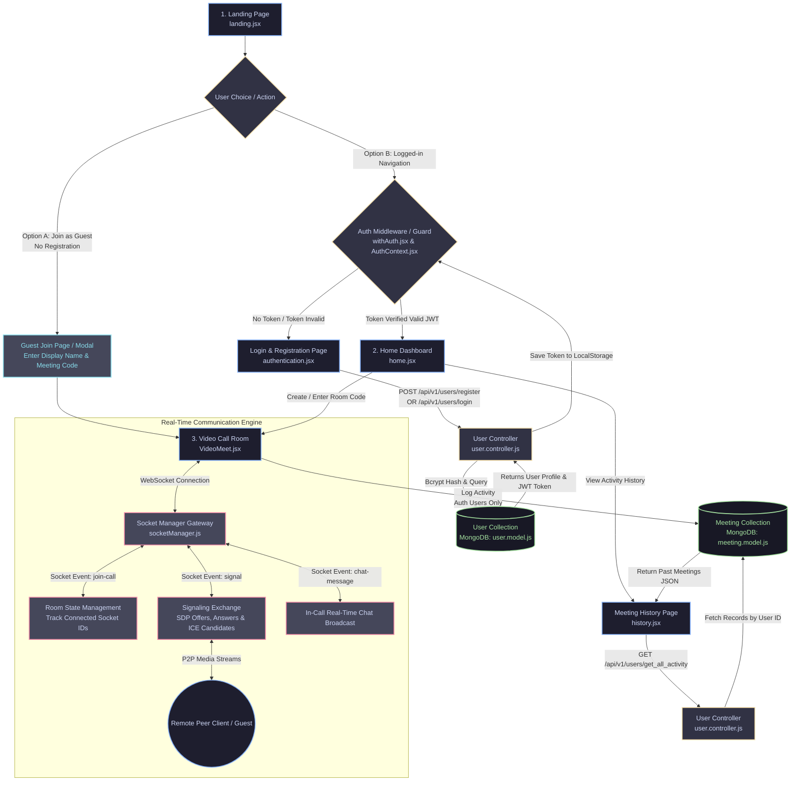

# Connectify

Full-stack video conferencing web app with real-time video/audio calling, authentication, meeting history, and Socket.IO integration.

System Flow Daigram

```mermaid
graph TD
    %% Styling definitions
    classDef page fill:#1e1e2e,stroke:#89b4fa,stroke-width:2px,color:#cdd6f4;
    classDef logic fill:#313244,stroke:#f9e2af,stroke-width:2px,color:#cdd6f4;
    classDef database fill:#181825,stroke:#a6e3a1,stroke-width:2px,color:#a6e3a1;
    classDef socket fill:#45475a,stroke:#f38ba8,stroke-width:2px,color:#cdd6f4;
    classDef guest fill:#45475a,stroke:#89dceb,stroke-width:2px,color:#89dceb;

    %% Entry Point
    A[1. Landing Page<br/>landing.jsx]:::page --> B{User Choice / Action}:::logic

    %% GUEST FLOW
    B -- Option A: Join as Guest<br/>No Registration --> G1[Guest Join Page / Modal<br/>Enter Display Name & Meeting Code]:::guest
    G1 --> V[3. Video Call Room<br/>VideoMeet.jsx]:::page

    %% AUTHENTICATED USER FLOW
    B -- Option B: Logged-in Navigation --> C{Auth Middleware / Guard<br/>withAuth.jsx & AuthContext.jsx}:::logic

    C -- No Token / Token Invalid --> D[Login & Registration Page<br/>authentication.jsx]:::page
    D -- POST /api/v1/users/register<br/>OR /api/v1/users/login --> E1[User Controller<br/>user.controller.js]:::logic
    E1 -- Bcrypt Hash & Query --> E2[(User Collection<br/>MongoDB: user.model.js)]:::database
    E2 -- Returns User Profile & JWT Token --> E1
    E1 -- Save Token to LocalStorage --> C

    C -- Token Verified Valid JWT --> F[2. Home Dashboard<br/>home.jsx]:::page

    %% DASHBOARD ACTIONS
    F -- Create / Enter Room Code --> V
    F -- View Activity History --> H1[Meeting History Page<br/>history.jsx]:::page
    H1 -- GET /api/v1/users/get_all_activity --> H2[User Controller<br/>user.controller.js]:::logic
    H2 -- Fetch Records by User ID --> H3[(Meeting Collection<br/>MongoDB: meeting.model.js)]:::database
    H3 -- Return Past Meetings JSON --> H1

    %% MEETING LOGGING FOR AUTH USERS
    V -- Log Activity<br/>Auth Users Only --> H3

    %% WEBRTC & SOCKET REAL-TIME ENGINE
    subgraph RealTimeEngine [Real-Time Communication Engine]
        V <-->|WebSocket Connection| S1[Socket Manager Gateway<br/>socketManager.js]:::socket
        
        S1 <-->|Socket Event: join-call| S2[Room State Management<br/>Track Connected Socket IDs]:::socket
        S1 <-->|Socket Event: signal| S3[Signaling Exchange<br/>SDP Offers, Answers & ICE Candidates]:::socket
        S1 <-->|Socket Event: chat-message| S4[In-Call Real-Time Chat Broadcast]:::socket
        
        S3 <-->|P2P Media Streams| P((Remote Peer Client / Guest)):::page
    end

```

